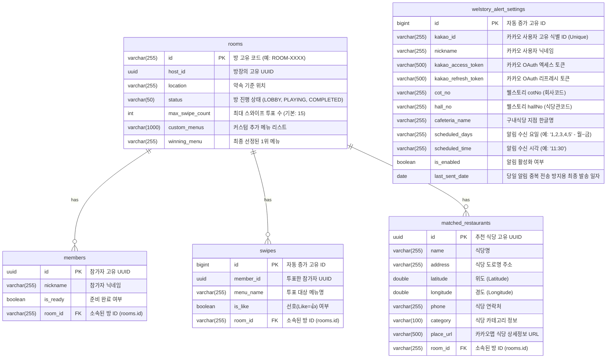

# 🗄️ 데이터 모델 및 임시 세션 설계서 (ERD & Session Schema)

본 문서는 실시간 그룹 메뉴 추천 서비스에서 활용할 **영속성 데이터베이스(RDB) 스키마**와 실시간 방 관리용 **임시 인메모리 세션 스키마**를 정의합니다.

데이터의 저장 성격에 따라 **영속 계층(MySQL/PostgreSQL)**과 **휘발성 계층(Redis/In-Memory Cache)**으로 명확하게 나누어 설계함으로써 높은 처리 성능과 아키텍처적 유연성을 보장합니다.

---

## 1. 전체 데이터 분리 아키텍처

```
┌────────────────────────────────────────────────────────────────────────┐
│                        클라이언트 (유저 브라우저)                      │
└───────────────────────────────────┬────────────────────────────────────┘
                                    │ WebSockets / REST
                                    ▼
┌────────────────────────────────────────────────────────────────────────┐
│                      Spring Boot (Hexagonal Core)                      │
└───────┬────────────────────────────────────────────────────────┬───────┘
        │ (Persistent Data)                                      │ (Volatile Real-time Session)
        ▼                                                        ▼
┌───────────────────────────────┐                        ┌───────────────────────────────┐
│        관계형 DB (RDB)        │                        │        인메모리 (Redis)       │
│   - 익명 유저 식별 정보       │                        │   - 현재 열려있는 대기방      │
│   - 종료된 게임 이력 (History) │                        │   - 접속자 목록 & 세션 상태   │
│   - 매칭된 맛집 이력          │                        │   - 실시간 스와이프 투표 현황 │
└───────────────────────────────┘                        └───────────────────────────────┘
```

---

## 2. 영속 데이터베이스 스키마 (RDB ERD)

영속성 계층은 실시간 방 개설 정보, 참가자 현황, 스와이프 투표 결과, 최종 매칭 맛집 기록 및 카카오톡 웰스토리 식단 정기 알림 구독 정보를 저장합니다.



### 테이블 컬럼 상세 정보

#### A. `rooms` (실시간 방 관리 테이블)
*   **용도:** 대기실 개설 및 게임 상태, 매칭 최종 결과 정보를 영속 저장합니다.

| 컬럼명 | 타입 | 제약 조건 | 설명 |
| :--- | :--- | :--- | :--- |
| `id` | VARCHAR(255) | PRIMARY KEY | 난수 형태의 방 고유 코드 (예: `ROOM-4201`) |
| `host_id` | BINARY(16) / UUID | NOT NULL | 대기방 방장의 고유 UUID 식별자 |
| `location` | VARCHAR(255) | NOT NULL | 방장이 지정한 약속 장소 기준 위치 |
| `status` | VARCHAR(50) | NOT NULL | 방 진행 단계 상태 (`LOBBY`, `PLAYING`, `COMPLETED`) |
| `max_swipe_count` | INT | NOT NULL (기본 15) | 본 방에서 스와이프할 카드 총 개수 |
| `custom_menus` | VARCHAR(1000) | NOT NULL | 사용자가 직접 추가한 커스텀 메뉴들의 리스트 (쉼표 구분) |
| `winning_menu` | VARCHAR(255) | NULL | 투표 알고리즘을 거쳐 최종 1위로 당선된 메뉴명 |

#### B. `members` (방 참여자 테이블)
*   **용도:** 개별 방에 소속되어 실시간 스와이프 투표에 관여하는 유저 세션 정보입니다.

| 컬럼명 | 타입 | 제약 조건 | 설명 |
| :--- | :--- | :--- | :--- |
| `id` | BINARY(16) / UUID | PRIMARY KEY | 참여 유저 고유 브라우저 식별자 |
| `nickname` | VARCHAR(255) | NOT NULL | 입장 시 입력한 임시 닉네임 |
| `is_ready` | BOOLEAN | NOT NULL | 대기실에서의 게임 시작 준비 완료 상태 여부 |
| `room_id` | VARCHAR(255) | FOREIGN KEY -> rooms.id | 해당 참여자가 소속되어 있는 대기방 ID |

#### C. `swipes` (실시간 스와이프 투표 정보)
*   **용도:** 유저들이 맛집 카드를 좌/우로 드래그하여 결정한 개별 선호 내역입니다.

| 컬럼명 | 타입 | 제약 조건 | 설명 |
| :--- | :--- | :--- | :--- |
| `id` | BIGINT | PRIMARY KEY (AUTO_INCREMENT) | 개별 투표 항목 고유 번호 |
| `member_id` | BINARY(16) / UUID | NOT NULL | 투표를 시행한 멤버의 UUID |
| `menu_name` | VARCHAR(255) | NOT NULL | 스와이프 대상 메뉴 이름 |
| `is_like` | BOOLEAN | NOT NULL | `True` = 좋아요👍 (Like), `False` = 싫어요👎 (Dislike) |
| `room_id` | VARCHAR(255) | FOREIGN KEY -> rooms.id | 해당 투표가 발생한 대기방 ID |

#### D. `matched_restaurants` (최종 추천 맛집 테이블)
*   **용도:** 최종 1위 당선 메뉴에 따라 반경 1km 주위 카카오 로컬 검색으로 확보해 제공된 5개 맛집 목록입니다.

| 컬럼명 | 타입 | 제약 조건 | 설명 |
| :--- | :--- | :--- | :--- |
| `id` | BINARY(16) / UUID | PRIMARY KEY | 개별 식당 고유 식별자 |
| `name` | VARCHAR(255) | NOT NULL | 카카오 로컬 API로부터 전달받은 가게 상호명 |
| `address` | VARCHAR(255) | NOT NULL | 지번 또는 도로명 주소 |
| `latitude` | DOUBLE | NOT NULL | 식당 위도 좌표 (Latitude) |
| `longitude` | DOUBLE | NOT NULL | 식당 경도 좌표 (Longitude) |
| `phone` | VARCHAR(255) | NULL | 식당 대표 전화번호 |
| `category` | VARCHAR(100) | NULL | 음식점 업태 및 상세 분류 카테고리 |
| `place_url` | VARCHAR(500) | NULL | 해당 맛집의 카카오맵 공식 상세 정보 페이지 URL |
| `room_id` | VARCHAR(255) | FOREIGN KEY -> rooms.id | 관련 매칭 결과 방 ID |

#### E. `welstory_alert_settings` (구내식당 카톡 알림 구독 설정 테이블)
*   **용도:** 매일 원하는 시간에 본인 닉네임과 지점 매핑 정보를 기반으로 웰스토리 식단을 알림톡 수령하는 정기 구독 신청 정보입니다.

| 컬럼명 | 타입 | 제약 조건 | 설명 |
| :--- | :--- | :--- | :--- |
| `id` | BIGINT | PRIMARY KEY (AUTO_INCREMENT) | 구독 고유 ID 번호 |
| `kakao_id` | VARCHAR(255) | NOT NULL (UNIQUE) | 카카오 로그인 API로부터 추출한 고유 회원 번호 |
| `nickname` | VARCHAR(255) | NOT NULL | 카카오 프로필 닉네임 |
| `kakao_access_token` | VARCHAR(500) | NOT NULL | 카카오 메시지 전송용 만료 주기 짧은 엑세스 토큰 |
| `kakao_refresh_token` | VARCHAR(500) | NOT NULL | 엑세스 토큰 자동 갱신을 위한 만료 주기 긴 리프레시 토큰 |
| `cot_no` | VARCHAR(255) | NOT NULL | 웰스토리 지점 회사 코드 (예: DSR 타워 `E5CW`) |
| `hall_no` | VARCHAR(255) | NOT NULL | 웰스토리 식당 식당관 코드 (예: 3층 식당 `E5CY`) |
| `cafeteria_name` | VARCHAR(255) | NOT NULL | 지정된 구내식당 지점 한글명 (예: `DSR 3F 테이크아웃`) |
| `scheduled_days` | VARCHAR(255) | NOT NULL | 알림을 받고자 하는 요일 번호 목록 (예: 월~금 = `"1,2,3,4,5"`) |
| `scheduled_time` | VARCHAR(255) | NOT NULL | 매일 알림을 수신할 시각 (예: `"11:30"`) |
| `is_enabled` | BOOLEAN | NOT NULL | 정기 알림 전송 활성화 상태 여부 |
| `last_sent_date` | DATE | NULL | 당일 중복 전송을 원천 차단하기 위한 최종 알림톡 발송 완료 일자 |

> [!NOTE]
> **인덱스 설계 최적화 (Index Performance optimization)**
> `welstory_alert_settings` 테이블은 매 분단위로 구동되는 자동 발송 스케줄러의 부하를 지극히 차단하기 위해 **`idx_welstory_schedule`** 복합 인덱스`(scheduled_time, is_enabled)`를 적용하고 있습니다. 이를 통해 수만 명 이상의 정기 구독 알림이 동작할 시에도 무지연 조회를 항시 보장합니다.

---

## 3. 휘발성 세션 데이터 구조 (Redis / Cache Schema)

실시간으로 빠르게 변화하고 게임 도중에만 유효한 정보는 RDB에 직접 Insert 하지 않고, Redis의 **Key-Value 스토리지 구조** 또는 **In-Memory HashMap**으로 관리합니다.

### A. 방 메타데이터 (`RoomSession`)
*   **Key 포맷:** `room:{roomId}:meta` (예: `room:ROOM-7392:meta`)
*   **DataType:** Hash (또는 JSON String)

```json
{
  "roomId": "ROOM-7392",
  "hostId": "usr_uuid_1111",
  "location": "강남역",
  "roomStatus": "LOBBY", // LOBBY, PLAYING, COMPLETED
  "createdAt": "2026-05-30T11:51:00Z"
}
```

### B. 방 접속 멤버 상태 (`RoomMembers`)
*   **Key 포맷:** `room:{roomId}:members` (예: `room:ROOM-7392:members`)
*   **DataType:** Set (접속 중인 유저의 UUID 목록) 또는 Hash (유저별 세부 상태)

| Field (User UUID) | Value (JSON) | 설명 |
| :--- | :--- | :--- |
| `usr_uuid_1111` | `{"nickname": "김스프", "isReady": true, "joinedAt": "..."}` | 방장의 정보 |
| `usr_uuid_2222` | `{"nickname": "이아키", "isReady": false, "joinedAt": "..."}` | 참가자 1의 정보 |

### C. 실시간 스와이프 누적 투표 기록 (`SwipeVotes`)
*   **Key 포맷:** `room:{roomId}:votes` (예: `room:ROOM-7392:votes`)
*   **DataType:** Hash (각 메뉴 아이템별 누적 스코어)
*   **동작 방식:** 유저가 투표할 때마다 원자적 연산(`HINCRBY`)을 통해 점수를 증감시킵니다.
    *   `Like (👍)` 수신 시: 해당 메뉴 필드에 `+1`
    *   `Dislike (👎)` 수신 시: 해당 메뉴 필드에 `-2` (또는 Veto 플래그 활성화)

| Field (Menu Name) | Value (Score) | 설명 |
| :--- | :--- | :--- |
| `삼겹살` | `3` | 3명이 Like 투표 |
| `떡볶이` | `1` | 3명 Like (+3), 1명 Dislike (-2) = 최종 1점 |
| `마라탕` | `-4` | 2명이 Dislike 투표 (기피 점수 가속) |

### D. 유저 개별 투표 진척도 (`UserSwipeProgress`)
*   **Key 포맷:** `room:{roomId}:user:{userId}:progress`
*   **DataType:** Set (이미 스와이프 완료한 메뉴 이름 목록)
*   **용도:** 유저가 전체 15개 카드 중 몇 개를 완료했는지 실시간 게이지 바로 친구들에게 브로드캐스트하기 위한 임시 진행 정보.
