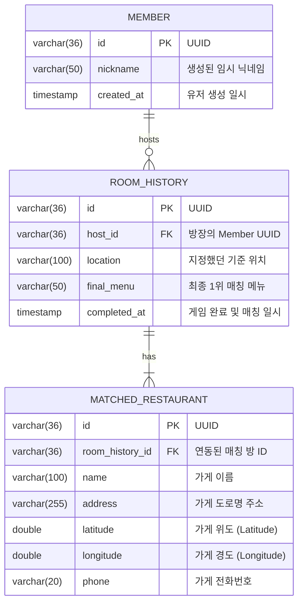

# 🗄️ 데이터 모델 및 임시 세션 설계서 (ERD & Session Schema)

본 문서는 실시간 그룹 메뉴 추천 서비스에서 활용할 **영속성 데이터베이스(RDB) 스키마**와 실시간 방 관리용 **임시 인메모리 세션 스키마**를 정의합니다.

데이터의 저장 성격에 따라 **영속 계층(MySQL/PostgreSQL)**과 **휘발성 계층(Redis/In-Memory Cache)**으로 명확하게 나누어 설계함으로써 높은 처리 성능과 아키텍처적 유연성을 보장합니다.

---

## 1. 전체 데이터 분리 아키텍처

```
┌────────────────────────────────────────────────────────────────────────┐
│                        클라이언트 (유저 브라우저)                      │
└───────────────────────────────────┬────────────────────────────────────┘
                                    │ WebSockets / REST
                                    ▼
┌────────────────────────────────────────────────────────────────────────┐
│                      Spring Boot (Hexagonal Core)                      │
└───────┬────────────────────────────────────────────────────────┬───────┘
        │ (Persistent Data)                                      │ (Volatile Real-time Session)
        ▼                                                        ▼
┌───────────────────────────────┐                        ┌───────────────────────────────┐
│        관계형 DB (RDB)        │                        │        인메모리 (Redis)       │
│   - 익명 유저 식별 정보       │                        │   - 현재 열려있는 대기방      │
│   - 종료된 게임 이력 (History) │                        │   - 접속자 목록 & 세션 상태   │
│   - 매칭된 맛집 이력          │                        │   - 실시간 스와이프 투표 현황 │
└───────────────────────────────┘                        └───────────────────────────────┘
```

---

## 2. 영속 데이터베이스 스키마 (RDB ERD)

영속성 계층은 매칭이 완전히 끝나 보존 가치가 있는 결과 정보와 간단한 유저 통계 정보만을 다룹니다.



### 테이블 컬럼 상세 정보

#### A. `MEMBER` (임시 유저 테이블)
*   **용도:** 비회원(익명) 참여자가 입장 시 발급받는 고유 세션 식별용 정보입니다. 24시간 뒤 배치 작업으로 일괄 제거됩니다.

| 컬럼명 | 타입 | 제약 조건 | 설명 |
| :--- | :--- | :--- | :--- |
| `id` | VARCHAR(36) | PRIMARY KEY (UUID) | 사용자의 브라우저 세션/쿠키에 저장되는 고유 ID |
| `nickname` | VARCHAR(50) | NOT NULL | 사용자가 대기방 참여 시 입력한 닉네임 |
| `created_at` | TIMESTAMP | DEFAULT CURRENT_TIMESTAMP | 유저 데이터 생성 일시 (배치 자동 소멸 기준) |

#### B. `ROOM_HISTORY` (완료된 게임 이력)
*   **용도:** 매칭 게임이 완료되어 최종 점수 집계가 끝났을 때 기록되는 이력 정보입니다. 향후 "우리 동네 최고 메뉴 순위" 등 통계 기능의 데이터로 사용됩니다.

| 컬럼명 | 타입 | 제약 조건 | 설명 |
| :--- | :--- | :--- | :--- |
| `id` | VARCHAR(36) | PRIMARY KEY (UUID) | 완료된 게임 방의 고유 매칭 ID |
| `host_id` | VARCHAR(36) | FOREIGN KEY -> MEMBER.id | 방을 개설한 방장 유저의 ID |
| `location` | VARCHAR(100) | NOT NULL | 방장이 지정한 약속 장소 (예: "강남역 2번출구") |
| `final_menu` | VARCHAR(50) | NOT NULL | 실시간 투표를 통해 최종 선택된 1위 메뉴명 |
| `completed_at` | TIMESTAMP | DEFAULT CURRENT_TIMESTAMP | 게임 매칭이 성사된 일시 |

#### C. `MATCHED_RESTAURANT` (매칭된 추천 식당)
*   **용도:** 최종 메뉴 확정 후 API 연동을 통해 사용자들에게 추천해 준 식당 목록입니다. 

| 컬럼명 | 타입 | 제약 조건 | 설명 |
| :--- | :--- | :--- | :--- |
| `id` | VARCHAR(36) | PRIMARY KEY (UUID) | 추천된 개별 식당 고유 식별자 |
| `room_history_id` | VARCHAR(36) | FOREIGN KEY -> ROOM_HISTORY.id | 관련 매칭 결과 방 ID |
| `name` | VARCHAR(100) | NOT NULL | 외부 지도 API로부터 받은 식당명 |
| `address` | VARCHAR(255) | NOT NULL | 식당 전체 주소 |
| `latitude` | DOUBLE | NOT NULL | 위도 (소수점 정밀도 확보) |
| `longitude` | DOUBLE | NOT NULL | 경도 (소수점 정밀도 확보) |
| `phone` | VARCHAR(20) | NULL | 식당 연락처 |

---

## 3. 휘발성 세션 데이터 구조 (Redis / Cache Schema)

실시간으로 빠르게 변화하고 게임 도중에만 유효한 정보는 RDB에 직접 Insert 하지 않고, Redis의 **Key-Value 스토리지 구조** 또는 **In-Memory HashMap**으로 관리합니다.

### A. 방 메타데이터 (`RoomSession`)
*   **Key 포맷:** `room:{roomId}:meta` (예: `room:ROOM-7392:meta`)
*   **DataType:** Hash (또는 JSON String)

```json
{
  "roomId": "ROOM-7392",
  "hostId": "usr_uuid_1111",
  "location": "강남역",
  "roomStatus": "LOBBY", // LOBBY, PLAYING, COMPLETED
  "createdAt": "2026-05-30T11:51:00Z"
}
```

### B. 방 접속 멤버 상태 (`RoomMembers`)
*   **Key 포맷:** `room:{roomId}:members` (예: `room:ROOM-7392:members`)
*   **DataType:** Set (접속 중인 유저의 UUID 목록) 또는 Hash (유저별 세부 상태)

| Field (User UUID) | Value (JSON) | 설명 |
| :--- | :--- | :--- |
| `usr_uuid_1111` | `{"nickname": "김스프", "isReady": true, "joinedAt": "..."}` | 방장의 정보 |
| `usr_uuid_2222` | `{"nickname": "이아키", "isReady": false, "joinedAt": "..."}` | 참가자 1의 정보 |

### C. 실시간 스와이프 누적 투표 기록 (`SwipeVotes`)
*   **Key 포맷:** `room:{roomId}:votes` (예: `room:ROOM-7392:votes`)
*   **DataType:** Hash (각 메뉴 아이템별 누적 스코어)
*   **동작 방식:** 유저가 투표할 때마다 원자적 연산(`HINCRBY`)을 통해 점수를 증감시킵니다.
    *   `Like (👍)` 수신 시: 해당 메뉴 필드에 `+1`
    *   `Dislike (👎)` 수신 시: 해당 메뉴 필드에 `-2` (또는 Veto 플래그 활성화)

| Field (Menu Name) | Value (Score) | 설명 |
| :--- | :--- | :--- |
| `삼겹살` | `3` | 3명이 Like 투표 |
| `떡볶이` | `1` | 3명 Like (+3), 1명 Dislike (-2) = 최종 1점 |
| `마라탕` | `-4` | 2명이 Dislike 투표 (기피 점수 가속) |

### D. 유저 개별 투표 진척도 (`UserSwipeProgress`)
*   **Key 포맷:** `room:{roomId}:user:{userId}:progress`
*   **DataType:** Set (이미 스와이프 완료한 메뉴 이름 목록)
*   **용도:** 유저가 전체 15개 카드 중 몇 개를 완료했는지 실시간 게이지 바로 친구들에게 브로드캐스트하기 위한 임시 진행 정보.
